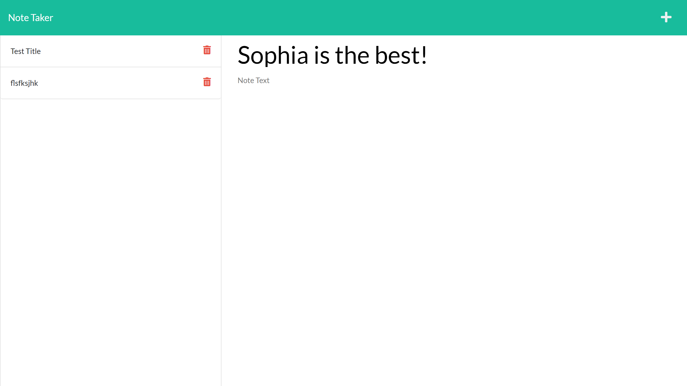

# Save Notes 


<p align="center">
    
    
</p>
<p align="center">
    
    
    
    
    
    
</p>

## Overview
A simple script based on node.js using the express - npm to create, save, and delete user notes based on the user's selection. 


## Table of Contents
- [Overview](#overview)
- [Authors](#authors)
- [Heroku](#heroku)
- [Preview](#preview)
- [Features](#features)
- [Installation](#installation)
- [Usage](#usage)
- [Test](#test)
- [Contribution](#contribution)
- [License](#license)
- [Bugs](#bugs)


## Authors
- Author: Sophia
- GitHub: [soph-k](https://github.com/soph-k)
- Version 1.1


## Heroku
[Heroku Link](https://sophk-heroku.herokuapp.com/)

## Preview



## Features
- HTML
- CSS
  - Bootstrap
- Javascript
- Node.js 
  - Express npm
- Heroku  


## Installation
The Save Notes Project is based upon NodeJs. 
Before using this project, please run the following commands below.
Be sure Express npm is installed.
If not, run the following commands in the following order: 
```
npm i
```
```
npm install express
```


## Contribution
Contributions are accepted. Feel free to fork without permission.


## License
This project is under the MIT license.


### Questions
For questions about this project, please review my GitHub repo at [soph-k](https://github.com/soph-k) or contact me on Github.


#### Bugs 
- No known bugs
